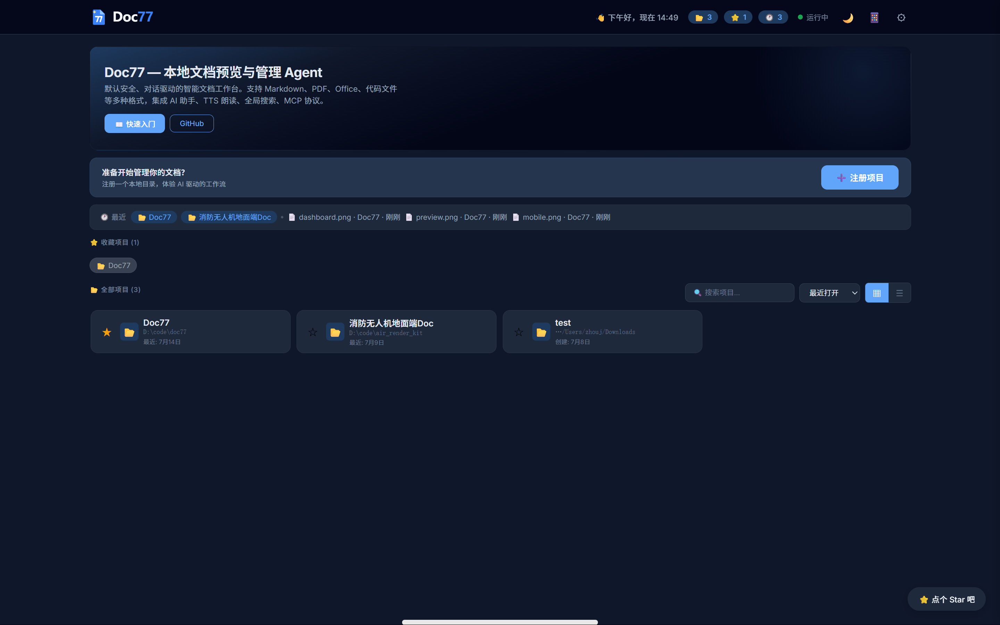
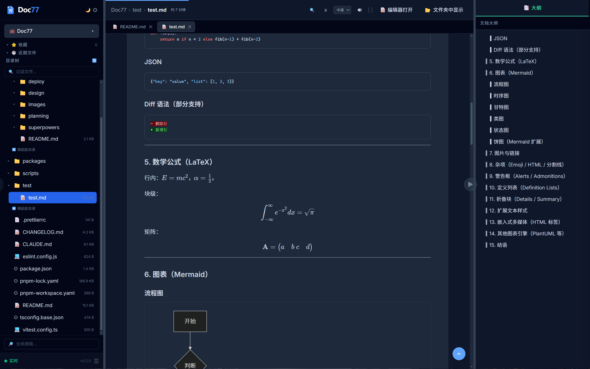
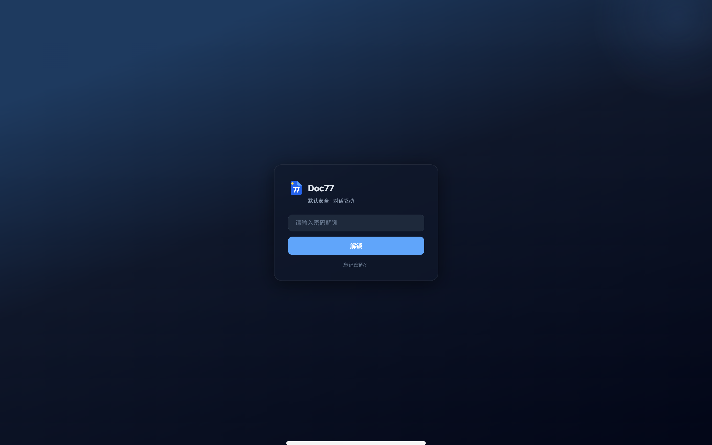
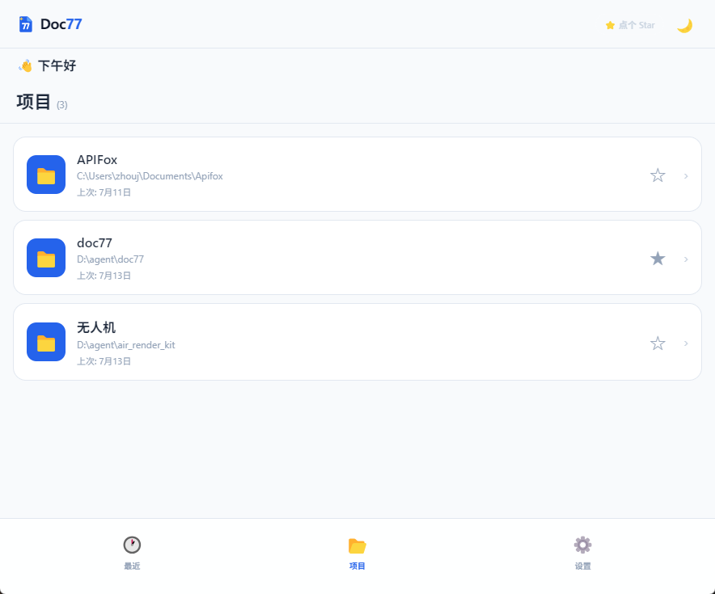

<p align="center">
  
</p>

<p align="center">
  <a href="https://github.com/xyy277/doc77/actions"></a>
  <a href="https://www.npmjs.com/package/idoc77"></a>
  <a href="LICENSE"></a>
  <a href="https://nodejs.org"></a>
</p>

# Doc77 — 本地文档预览与管理 · Markdown · PDF · MCP Server · 局域网共享

> 文档预览器 | 文档管理器 | Markdown 阅读器 | PDF 查看器 | Code Viewer | 知识库 | 局域网文档服务器
>
> 开源 · 免费 · 跨平台 · 移动端适配 · 零配置 · 📦 桌面版

**Doc77** 是轻量级本地文档预览器 + MCP 文件操作桥梁 + AI 对话驱动管理 Agent。浏览器即文档工作台，支持 Windows / macOS / Linux / WSL。提供 Electron 桌面版，非技术用户双击即用。密码保护下可安全对外暴露。

只读时是多项目陈列馆，写入时是需你审批的智能管家——所有文件操作经你确认后才执行，内置安全审批、原子化事务回滚与跨盘容错。

## 预览

| Dashboard | 文档预览 |
|---|---|
|  |  |

| 密码登录 | 移动端 |
|---|---|
|  |  |

## 适用场景

| 场景 | 说明 |
|---|---|
| **📚 个人知识库** | 本地文件夹即知识库，浏览器做前端。Obsidian / Notion 之外的轻量选择，文件永远在自己手里 |
| **📝 技术写作** | 写 Markdown 即时预览效果，TTS 朗读检查语句通顺。支持 MDX、Mermaid 图表，文档工程师利器 |
| **🎓 学术研究** | 管理论文 PDF + 笔记 MD + 实验代码，一个项目目录全搞定。AI 总结帮你快速浏览文献摘要 |
| **🏠 NAS / 家庭服务器** | NAS 上跑 doc77，全家设备浏览器访问文档库。密码保护，照片、文档、电子书统一入口 |
| **💼 远程办公** | VPN 连回公司电脑看文档，不用远程桌面，浏览器就够。省带宽，省内存 |
| **🔧 运维排查** | 服务器上看日志、配置文件，结合 MCP 让 AI 辅助诊断。审批机制确保不会误操作 |
| **🎤 技术面试** | 面试官一键分享代码 / 设计文档链接，候选人浏览器直接看。讨论方便，无需屏幕共享 |
| **🐳 Docker 部署** | 挂载文档卷，容器内启动。CI/CD 产物文档即时预览，开发环境文档统一入口 |
| **📡 局域网会议共享** | 一人 `doc77 start --bind 0.0.0.0`，全屋设备浏览器直接看。会议讨论需求文档、设计方案，各自设备同步浏览 |
| **📱 移动端随时查阅** | 手机 / 平板自适应 UI，通勤路上、客户现场也能浏览项目文档。响应式设计，桌面端和移动端一致体验 |
| **🔄 Win+WSL 混合开发** | WSL 里写代码，Windows 里办公。以前看 MD 要 SSH 下载或用黑终端 less 翻页；现在 `doc77 start --bind 0.0.0.0` 一行命令，Windows 浏览器直接预览，手机平板也能看。效率提升一个量级 |
| **🤖 Agent / MCP 开发** | 内置 MCP Server（stdio + HTTP），8 个 Tool 暴露文件系统能力。调试 Agent 时直接在 Web 端查看文件变动、审批写操作 |
| **🪟 纯 Windows 办公** | 完全免费开源的文档预览工具。Markdown、PDF、Office、代码高亮一站搞定，不像某些 GUI 软件读个 MD 还要付费 |
| **🗄️ 多项目文档管理** | 一次注册永久记住，Dashboard 统一切换。收藏夹、近期文件、全局搜索、目录树，像 IDE 一样浏览本地文档 |
| **🔒 安全团队共享** | 内网一键分享 + 密码保护。文档留在你的设备上，不落地到任何人那里。审批工作流确保写入操作可控 |
| **⚡ 零配置文档门户** | `npm install -g` → `doc77 register` → 浏览器打开。不用配 nginx，不用装 Apache，三分钟拥有私人文档门户 |

## 当前定位

**Doc77 专注做最好的预览体验，暂不支持编辑。** 需要编辑时一键唤起 VS Code 或系统编辑器。如果编辑需求足够大，未来再考虑内置。目前聚焦：

- 🚀 **性能** — 即开即用，大文件不卡顿
- 🐛 **稳定性** — 多平台兼容，消灭体验 bug
- ✨ **预览质量** — 格式支持、阅读工具、AI 辅助做到极致

## v0.7 能力概览

| 模块 | 内容 |
|---|---|
| **Markdown 增强** | Emoji 短码（`:smile:`）、高亮标记（`==highlight==`）、GitHub 警告框（`[!NOTE]`）、脚注、标题自动锚点 |
| **图表与公式** | Mermaid 流程图 / 时序图 / 甘特图 + KaTeX 数学公式 + PlantUML（kroki.io，离线降级源码） |
| **代码交互** | 代码块右上角一键复制按钮，44+ 语言语法高亮 |
| **离线优先** | `doc77 vendor-install` 下载 CDN 资源到本地，Electron 构建时已打包内置，无网可用 |
| **Dashboard 重新设计** | 渐变景深背景 + 登录页毛玻璃效果 + 回到顶部按钮 + 最近浏览 bug 修复 |
| **文档格式矩阵** | 支持格式一览表 + 离线可用性对照表 |
| **多 Tab 预览** | 同一浏览器多 Tab 打开文档，面包屑可点击导航 |
| **本地路径自动重写** | Markdown 中的本地文件路径自动转成 API 端点，保证预览可用 |
| **密码升级迁移** | 旧版哈希自动检测并引导重新设置密码，配置数据安全迁移 |
| **Electron 离线打包** | Vendor 资源通过 extraResources 内置，双击安装即含全部依赖 |
| **版本号同步脚本** | `scripts/sync-version.cjs` 自动同步 monorepo 各包版本 |

## 安装

### 桌面版（推荐普通用户）

| 平台 | 下载 |
|---|---|
| Windows | [📦 Doc77-Setup.exe](https://github.com/xyy277/doc77/releases/latest) |
| macOS | [📦 Doc77.dmg](https://github.com/xyy277/doc77/releases/latest) |
| Linux | [📦 Doc77.AppImage](https://github.com/xyy277/doc77/releases/latest) |

双击安装，桌面快捷方式启动。原生系统对话框选文件夹，开箱即用。

### 命令行版（推荐开发者）

```bash
npm install -g idoc77                # 安装
doc77 register ./my-docs --name "我的文档"   # 注册项目
doc77 start                          # 启动（127.0.0.1:3099）
doc77 start --bind 0.0.0.0           # 或允许局域网访问
```

## 命令参考

### 核心命令

| 命令 | 说明 |
|---|---|
| `doc77 start [--port <n>] [--bind <addr>]` | 启动 Web Dashboard（默认端口 3099） |
| `doc77 register <path> [--name <n>]` | 注册项目目录 |
| `doc77 list [--json]` | 列出所有已注册项目 |
| `doc77 remove <id>` | 按 ID 移除项目（不会删除源文件） |
| `doc77 update <id> [--name <n>] [--path <p>]` | 更新项目名称或路径 |
| `doc77 status` | 查看服务状态 |

### 配置管理

| 命令 | 说明 |
|---|---|
| `doc77 config set <key> <value>` | 设置配置项 |
| `doc77 config get <key>` | 获取配置项 |
| `doc77 config list` | 列出所有配置 |
| `doc77 config set-password` | 设置访问密码（首次） |
| `doc77 config change-password` | 修改访问密码 |
| `doc77 config reset-password` | 使用恢复码重置密码 |
| `doc77 config reset-password --force` | 强制重置（清空加密配置） |
| `doc77 config recovery-codes` | 重新生成恢复码 |

常用配置项：

| Key | 说明 | 默认值 |
|---|---|---|
| `ai.enabled` | 启用 AI 助手 | `false` |
| `ai.token` | AI API Token | — |
| `ai.base_url` | AI API Base URL | `https://api.deepseek.com` |
| `ai.model` | 模型名称 | `deepseek-v4-pro` |
| `editor.default` | 默认编辑器 | `vscode` |

### MCP 服务

| 命令 | 说明 |
|---|---|
| `doc77 mcp serve [--http] [--port <n>]` | 启动 MCP 服务（stdio 或 HTTP 传输） |

### 任务审批

| 命令 | 说明 |
|---|---|
| `doc77 approve --list` | 列出待审批任务 |
| `doc77 approve --accept <task_id>` | 批准指定任务 |
| `doc77 approve --reject <task_id>` | 拒绝指定任务 |
| `doc77 approve --accept --all` | 批量批准 |
| `doc77 approve --reject --all` | 批量拒绝 |

### 锁管理

| 命令 | 说明 |
|---|---|
| `doc77 lock status` | 查看活跃的项目锁 |
| `doc77 lock release <project_id>` | 手动释放项目锁 |

### 离线支持

```bash
# 下载所有 CDN 资源到本地（约 16MB）
doc77 vendor-install

# 跳过 Pyodide（Python 运行时），节省 ~12MB
doc77 vendor-install --no-pyodide
```

资源缓存到 `~/.doc77/vendor/`，重启服务后自动生效。重复执行会跳过已下载的文件。

## 支持的格式

| 格式 | 扩展名 | 阅读模式 |
|---|---|---|
| **Markdown** | `.md` `.mdx` `.markdown` | ✅ TTS/搜索/大纲/进度 |
| **Mermaid 图表** | `.mermaid` `.mmd` | ✅ |
| **代码** (~44 种) | `.ts` `.js` `.py` `.go` `.rs` `.java` `.c` `.cpp` `.html` `.css` `.json` … | ✅ 语法高亮 |
| **PDF** | `.pdf` | ✅ 浏览器原生预览 + 一键全屏 |
| **图片** (9 种) | `.png` `.jpg` `.gif` `.svg` `.webp` `.avif` `.bmp` `.ico` | ✅ Lightbox 缩放/导航 |
| **Word 文档** | `.docx` | ✅ mammoth.js 渲染 |
| **Excel 表格** | `.xlsx` `.xls` | ✅ SheetJS 渲染 + Tab 切换 |
| **JavaScript 执行** | `.js` | ✅ Sandbox 运行 |
| **Python 执行** | `.py` | ✅ Pyodide WASM 运行 |
| **不支持的格式** | `.mp4` `.zip` `.exe` `.shp` `.psd` … | ❌ 文件信息卡 + 文件夹中显示 |

### Markdown 语法支持

| 功能 | 语法示例 | 状态 |
|---|---|---|
| 标题 / 加粗 / 斜体 / 删除线 | `# H1`, `**b**`, `*i*`, `~~del~~` | ✅ GFM |
| 列表（嵌套 / 有序 / 无序） | `1.`, `- `, 缩进 | ✅ GFM |
| 任务列表 | `- [x]` `- [ ]` | ✅ GFM |
| 表格（含对齐） | `|:---|:---:|---:|` | ✅ GFM |
| 引用块 / 分割线 | `> quote`, `---` | ✅ GFM |
| 图片 / 链接 / 图片链接 | ``, `[text](url)` | ✅ 本地路径自动重写为 API |
| 代码块 + 语法高亮 | ` ```python ` | ✅ highlight.js (44+ 语言) |
| 代码复制按钮 | hover 右上角 | ✅ |
| 数学公式（行内 / 块） | `$E=mc^2$`, `$$\int$$` | ✅ KaTeX |
| Mermaid 图表 | ` ```mermaid ` | ✅ 流程图 / 时序图 / 甘特图 / 类图 / 状态图 / 饼图 |
| PlantUML 图表 | ` ```plantuml ` | ✅ kroki.io（离线降级源码） |
| Emoji 短码 | `:smile:` `:rocket:` `:heart:` | ✅ |
| 高亮标记 | `==highlight==` | ✅ `<mark>` |
| 脚注 | `[^1]` `[^2]` | ✅ |
| GitHub 警告框 | `> [!NOTE]` `> [!WARNING]` | ✅ |
| 折叠块 | `<details><summary>` | ✅ HTML 原生 |
| 标题锚点 | `## My Heading` → `#my-heading` | ✅ |
| 原始 HTML | `<kbd>`, `<sup>`, `<audio>`, `<video>` | ✅ 浏览器原生 |
| 定义列表 | `Term : definition` | ❌ |
| 自动目录 | `[TOC]` | ⚠️ 前端已有大纲面板替代 |

## 离线可用性

Doc77 通过 vendor 系统提供 CDN → 本地回退。`doc77 vendor-install` 下载资源到 `~/.doc77/vendor/`。Electron 桌面版在构建时已将 vendor 资源打包内置（extraResources）。

| 功能 | 依赖库 | CLI `vendor-install` | Electron 内置 | 离线不可用时 |
|---|---|---|---|---|
| **Tailwind CSS** | `tailwind.js` | ✅ | ✅ | 3s 超时降级无样式 |
| **highlight.js** | `highlight.min.js` | ✅ | ✅ | 代码块无语法高亮 |
| **Mermaid 图表** | `mermaid.min.js` | ✅ | ✅ | 显示源码 |
| **KaTeX 数学** | `katex.min.js` | ✅ | ✅ | 显示 LaTeX 原文 |
| **XLSX 预览** | `xlsx.mini.min.js` | ✅ | ✅ | .xlsx 不可预览 |
| **DOCX 预览** | `mammoth.browser.min.js` | ✅ | ✅ | .docx 不可预览 |
| **Python 执行** | `pyodide.js` + wasm | ⚠️ 需额外 ~12MB | ❌ 未内置 | .py 不可执行 |
| **PlantUML** | kroki.io | ❌ 需联网 | ❌ 需联网 | 显示源码 |

## 一键重启

```bash
./scripts/restart.sh              # 默认端口 3099
./scripts/restart.sh --port 8080  # 自定义端口
```

> 如需绑定 `0.0.0.0` 允许外部访问，使用 `doc77 start --bind 0.0.0.0`（启用后需要设置访问密码）。

## 功能概览

| 功能 | 说明 |
|---|---|
| **多项目预览** | 注册多个本地目录，Dashboard 统一管理，Markdown / Mermaid / PDF / 图片即时预览 |
| **阅读模式** | TTS 朗读、自动滚动、阅读进度、文档内搜索 (Ctrl+F)、AI 摘要 |
| **MCP 文件操作** | 通过 MCP 协议暴露 8 个 Tool（list_files, read_file, write_file, batch_operations 等），AI 可安全读写本地文件 |
| **审批工作流** | 所有写操作默认入队等待用户审批，支持 CLI 和 Web 双通道审批 |
| **事务回滚** | Pre-flight 检查 + Shadow 备份 + 逆序回滚，批量操作失败时自动恢复 |
| **AI 文档管理** | 自然语言对话驱动，智能归类建议、批量操作规划、文档总结分析 |
| **安全设计** | 路径沙箱、敏感文件过滤、信封加密（DEK）、恢复码密码重置、暴力破解防护、Session 管理、审计日志 |

## 设计哲学

1. **文档留在原地** — 绝不复制/上传用户文件，只读本地路径
2. **预览 ≠ 编辑** — 编辑交给专业工具（VS Code / Typora），预览交给 Doc77
3. **注册即管理** — 一次注册项目目录，永久记住，点开即用
4. **轻量优先** — 单进程、SQLite、零配置、开箱即用
5. **对话驱动** — 自然语言交互，AI 辅助规划，用户最终决策

## 文档

| 文档 | 说明 |
|---|---|
| [系统架构设计](docs/design/system-architecture.md) | 完整设计方案 |
| [架构分析报告](docs/analysis/system-architecture-analysis.md) | Technology Stack 验证与 Architecture 评审 |
| [实施方案](docs/planning/implementation-plan.md) | 40 个 Task、9 个 Phase 详细计划 |
| [实施进度](docs/planning/implementation-status.md) | 实时开发进度跟踪 |
| [变更日志](CHANGELOG.md) | 版本变更记录 |

## 技术栈

| 组件 | 选型 |
|---|---|
| Runtime | Node.js >= 22.x |
| Language | TypeScript ^5.8 |
| Web Framework | Express 5.x |
| Database | SQLite（sql.js） |
| MCP Protocol | @modelcontextprotocol/sdk |
| Frontend | 原生 HTML + CSS + JS（marked, Mermaid, highlight.js）+ 浏览器原生 PDF / HTML 预览 |
| Build | tsup + pnpm workspaces |
| Test | Vitest |

## 项目结构

```
doc77/
├── packages/
│   ├── core/          # @doc77/core  预览引擎 + 文件系统抽象层 + Express Server
│   ├── mcp/           # @doc77/mcp   MCP 服务层 + 安全校验 + 事务系统
│   ├── ai/            # @doc77/ai    AI Provider + Agent 核心 + Chat API
│   └── cli/           # doc77 CLI    命令行入口
├── docs/
│   ├── design/        # 设计文档
│   ├── analysis/      # 分析报告
│   └── planning/      # 实施规划
├── scripts/           # 工具脚本
├── CLAUDE.md          # 项目规范
└── README.md          # 本文件
```

## 隐私与安全

- 所有数据存储在本地 `~/.doc77/`
- AI Token 加密存储在 SQLite 数据库
- 不向外部服务器发送任何文件内容（除非手动启用 AI 功能）
- 支持访问密码保护

## 开源协议

[MIT License](LICENSE)
