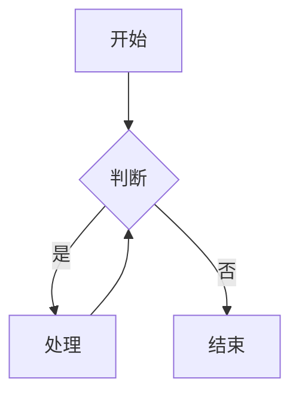
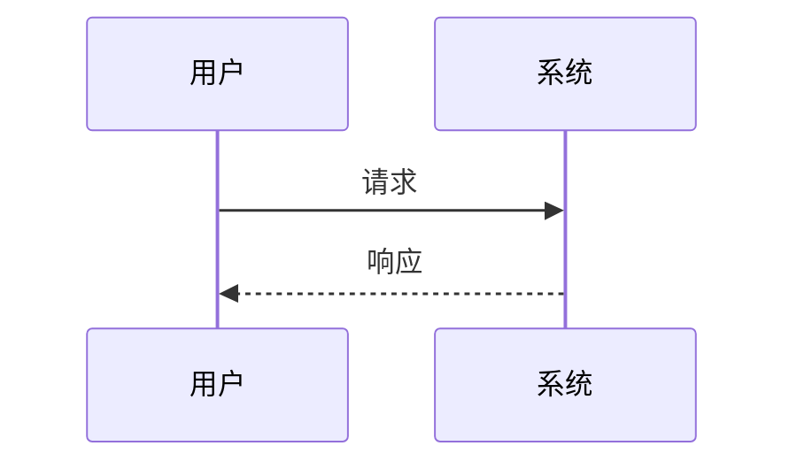
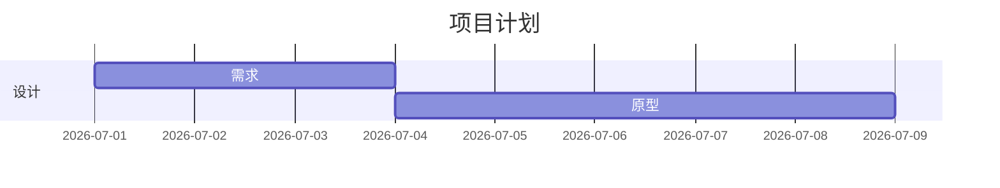
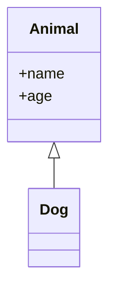
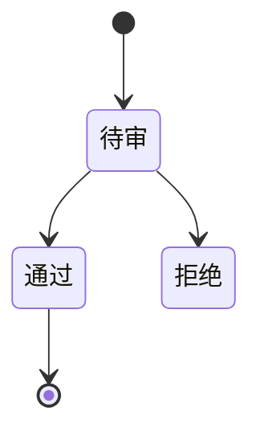
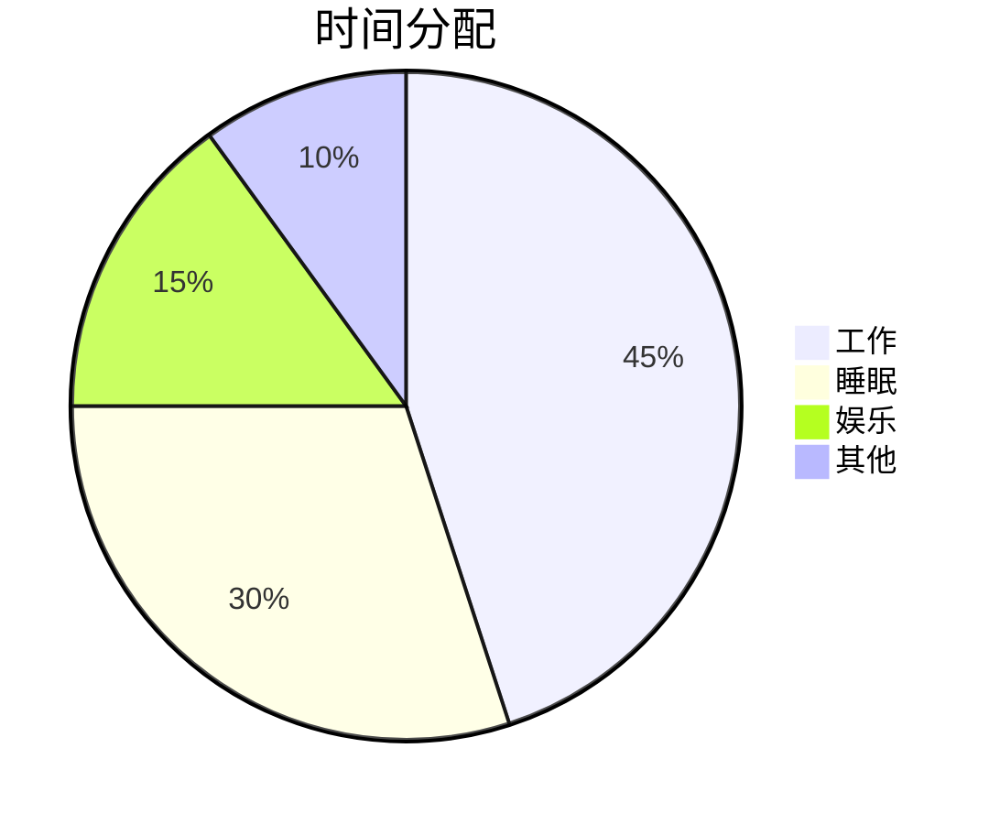
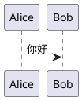

以下是为您整合的**完整 Markdown 测试文档**，它融合了您原有的核心内容与所有推荐的扩展语法（警告框、定义列表、目录、折叠块、饼图、高亮、嵌入标签、提及等）。您可以直接复制全文，粘贴到目标阅读器中进行兼容性测试。

---

```markdown
# 完整 Markdown 测试文档（兼容性覆盖版）

> **用途**：本文档囊括 Markdown 核心语法、GFM 扩展及多种常见渲染器特有语法，用于检测阅读器对各类元素的渲染效果。  
> **说明**：部分扩展（如警告框、定义列表、`[TOC]`、`==高亮==` 等）可能不被所有引擎支持，若渲染失败则说明阅读器不支持该类型。

---

## 目录（自动生成，如支持）
[TOC]

---

## 1. 文本样式与段落

**加粗**，*斜体*，***加粗斜体***，~~删除线~~，<u>下划线（HTML）</u>，行内 `code`。

> 这是引用块（blockquote），支持 **嵌套** 和列表：
> - 引用内列表项 1
> - 引用内列表项 2
>> 二级引用（嵌套）
>>> 三级引用

脚注示例[^1]，另一个脚注[^2]。

[^1]: 第一个脚注，可包含*格式*。
[^2]: 第二个脚注，含代码 `print("hello")`。

---

## 2. 列表

### 无序列表
- 项目 A
  - 子项 A1
    - 更深层
- 项目 B

### 有序列表
1. 步骤一
   1. 子步骤 1.1
   2. 子步骤 1.2
2. 步骤二

### 任务列表（GFM）
- [x] 已完成任务
- [ ] 待办事项
- [x] 另一个完成项

---

## 3. 表格（含对齐）

| 左对齐 | 居中对齐 | 右对齐 |
|:-------|:--------:|-------:|
| 单元格1 | 单元格2  | 100.00 |
| 长文本   | 中间     |    -99 |

---

## 4. 代码块

### 普通（无高亮）
```
print("Hello")
```

### 语法高亮（Python）
```python
def fib(n):
    return n if n < 2 else fib(n-1) + fib(n-2)
```

### JSON
```json
{"key": "value", "list": [1, 2, 3]}
```

### Diff 语法（部分支持）
```diff
- 删除行
+ 新增行
```

---

## 5. 数学公式（LaTeX）

行内：$E = mc^2$，$\alpha = \frac{1}{2}$。

块级：

$$
\int_{-\infty}^{\infty} e^{-x^2} dx = \sqrt{\pi}
$$

矩阵：

$$
\mathbf{A} = \begin{pmatrix}
a & b \\ c & d
\end{pmatrix}
$$

---

## 6. 图表（Mermaid）

### 流程图


### 时序图


### 甘特图


### 类图


### 状态图


### 饼图（Mermaid 扩展）


---

## 7. 图片与链接


[点击跳转](https://example.com)

[](https://example.com)

内部锚点：[跳至第 12 章](#12-扩展补充测试)

---

## 8. 杂项（Emoji / HTML / 分割线）

:smile: :heart: :rocket:  （Emoji 短码）

<span style="color:red;">红色文字</span>，<kbd>Ctrl</kbd>+<kbd>C</kbd>，<sup>上标</sup>，<sub>下标</sub>。

---

水平分割线

---

## 9. 警告框（Alerts / Admonitions）

> [!NOTE]
> 这是一个笔记（Note）类警告框。

> [!TIP]
> 这是一个提示（Tip）类警告框。

> [!WARNING]
> 这是一个警告（Warning）类警告框。

> [!CAUTION]
> 这是一个小心（Caution）类警告框。

---

## 10. 定义列表（Definition Lists）

术语 A
: 这是术语 A 的定义。

术语 B
: 这是术语 B 的定义，可以包含 **格式**。
: 也可以有多个定义。

---

## 11. 折叠块（Details / Summary）

<details>
<summary>点击展开查看详情</summary>

这里是折叠的内容，可以包含 **Markdown** 格式：
- 列表项
- 代码 `print("inside")`

</details>

---

## 12. 扩展文本样式

- 高亮（部分引擎支持 `==`）：这是一段 ==高亮文本==。
- 提及用户（如 GitHub）：@username
- 引用 Issue / PR：#123 或 !456
- 快捷键标记：<kbd>Ctrl</kbd> + <kbd>Shift</kbd> + <kbd>P</kbd>

---

## 13. 嵌入式多媒体（HTML 标签）

<audio controls>
  <source src="https://www.soundhelix.com/examples/mp3/SoundHelix-Song-1.mp3" type="audio/mpeg">
  您的浏览器不支持音频。
</audio>

<video width="320" height="240" controls>
  <source src="https://www.w3schools.com/html/mov_bbb.mp4" type="video/mp4">
  您的浏览器不支持视频。
</video>

（注：部分阅读器可能屏蔽外部媒体或禁止自动播放。）

---

## 14. 其他图表引擎（PlantUML 等）

若支持 PlantUML，可尝试：

（需阅读器额外支持）

---

## 15. 结语

本测试文档涵盖了：
- 基础语法（标题、样式、列表、引用、链接、图片、分割线）
- 表格、代码高亮、脚注、任务列表
- 数学公式（LaTeX）
- Mermaid 图表（流程图、时序图、甘特图、类图、状态图、饼图）
- 扩展块（警告框、定义列表、折叠块）
- HTML 标签（颜色、上/下标、多媒体）
- 特定平台语法（提及、引用、高亮等）

**渲染结果取决于目标阅读器的支持范围。** 若某项未显示，即说明该阅读器不支持或需额外配置。

---

*生成日期：2026年7月14日*  
*版本：3.0（完整版）*
```

---

您可以直接将上述内容保存为 `.md` 文件，然后用目标阅读器打开，逐项检查渲染效果。若某些部分未能正常显示（如 Mermaid 图表、警告框、数学公式等），则说明该阅读器对这些扩展的支持有限。希望这份文档能帮助您全面评估阅读器的兼容性！如有其他需求，欢迎继续提问。